# STRUKTUR DASAR HTML

```HTML 
<!DOCTYPE html>
<html>
    <head>
     <title>adel uhuy</title>
    </head>
    <body bgcolor="pink">
        <p>Apa yang di maksud dengan adel?</p>
    </body>
</html> 
```

- Tag `<!DOCTYPE html>` memberitahukan web browser bahwa dokumen HTML adalah versi 5
- Tag pembuka `<html>` menandai awal sebuah dokumen HTML sampai tag penutup `</html>`
- Tag pembuka `<head>` berisi informasi tentang halaman HTML sampai dengan tag penutup `</head>` biasanya tag head terdapat tag `<title>` untuk memberikan informasi judul halaman HTML 
- Apapun tag yang berada di antara tag pembuka `<body>` sampai dengan tag penutup `</body>` akan tampil di browser.


# Anatomi Elemen HTML
Elemen HTML `<a>` digunakan untuk membuat tautan atau hyperlink dalam dokumen HTML. `<a>` dapat digunakan untuk mengarahkan pengguna ke halaman web, dan file.
```
  <a href="https://www.google.com"> Klik google </a>
```
- Tag pembuka `<a>` digunakan untuk membuat link (tautan) yang ditutup dengan tag penutup `</a>`
- Atribut `href` untuk menentukan alamat yang akan dituju
- `https://google.com`  merupakan nilai dari atribut `href` 
- `Klik google !` merupakan konten pada tag `<a>` dan akan tampil di web browser seperti di bawah ini.

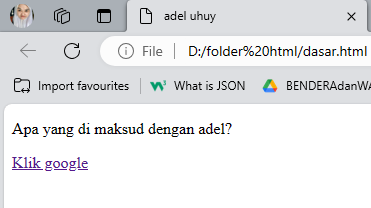


# Tag Dasar
## Heading 
Heading tag adalah tag HTML yang digunakan untuk mendefinisikan judul dan sub-judul pada web, yang dimana semakin tinggi angkanya semakin kecil ukurannya

```html
<!DOCTYPE html>
<html>
    <head>
        <title> TAG DASAR </title>
    </head>
    <body>
        <h1> APA ITU TAG DASAR </h1>
        <h2> APA ITU TAG DASAR </h2>
        <h3> APA ITU TAG DASAR </h3>
        <h4> APA ITU TAG DASAR </h4>
        <h5> APA ITU TAG DASAR </h5>
        <h6> APA ITU TAG DASAR </h6>
    </body>
</html>
```

Di bawah ini merupakan hasil dari kode program di atas.

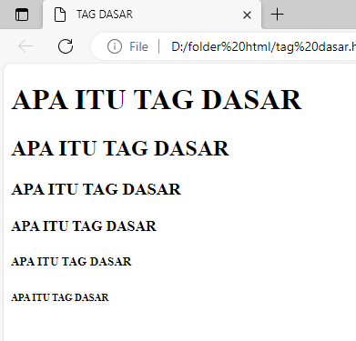

## Paragraf
### Tag `<p>` 
**element** menunjukkan sebuah _Paragraph_, atau paragraf sebuah teks yang di akhiri `</p>` 
### Tag `<b>` 
Untuk membuat tulisan menjadi tebal.
### Tag `<u>` 
berfungsi untuk memberikan garis bawah pada bagian tertentu, seperti tautan penting atau detail yang diinginkan.
### Tag `<br>`
digunakan untuk membuat baris baru dalam sebuah elemen teks atau konten HTML.

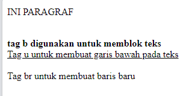

## Align
 Align adalah atribut yang menentukan perataan teks.
 
 ```html
 <html>
    <head>
     <title>adel uhuy</title>
    </head>
    <body>
    <p align="left">
Lorem ipsum is a placeholder text commonly used in publishing and graphic design to demonstrate the visual form of a document or a typeface without relying on meaningful content </p>
    <p align="right">
Lorem ipsum is a placeholder text commonly used in publishing and graphic design to demonstrate the visual form of a document or a typeface without relying on meaningful content </p>
    <p align="center">
Lorem ipsum is a placeholder text commonly used in publishing and graphic design to demonstrate the visual form of a document or a typeface without relying on meaningful content </p>
    <p align="justhify">
Lorem ipsum is a placeholder text commonly used in publishing and graphic design to demonstrate the visual form of a document or a typeface without relying on meaningful content </p>
    </body>
</html>
```

### `<p align="left">` 
untuk membuat teks rata kiri
### `<p align="right">` 
untuk membuat teks rata kanan
### `<p align="center">` 
untuk membuat teks rata tengah
### `<p align="justify">` 
untuk membuat teks rata kiri dan kanan


>  Foto dibawah merupakan hasil dari program di atas.

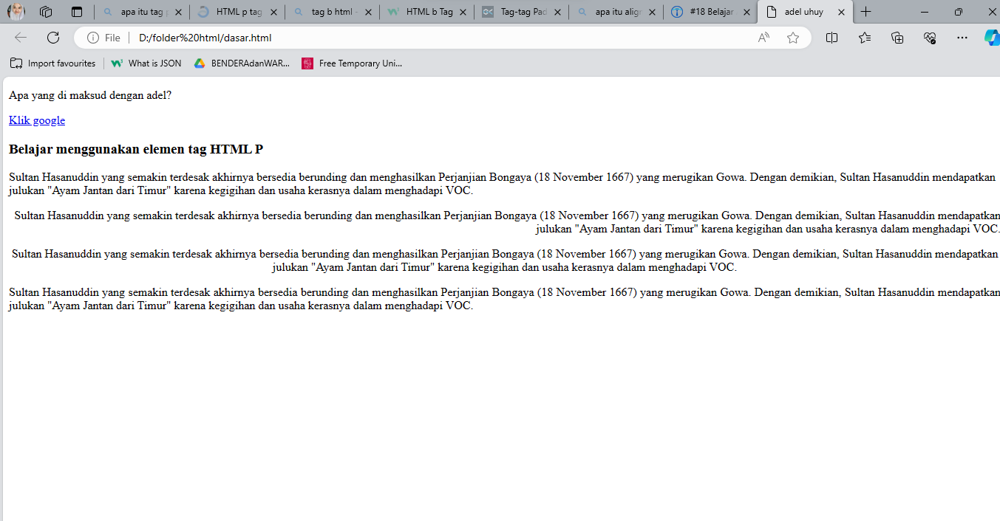

## Komentar 
HTML juga mempunyai tag khusus untuk komentar untuk membuat komentar di HTML kita menggunakan awalan `<!--` dan penutup `-->`

>[! faq]- Komentar tidak akan ditampilkan pada halaman website namun progammer biasanya menggunakan komentar untuk memperjelas kode program.

Contoh:
```html 
<!DOCTYPE html>

<html>

    <head>
     <title>JUDUL HALAMAN </title>
    </head>

    <body>
        <!-- ini komentar, tidak akan muncul di browser -->
        <p> ini bukan komentar, dan akan tampil di browser</p>

    </body>

</html>
```

 dan hasil yang akan ditampilkan yaitu 
 
 
 

## List 
List adalah fungsi HTML yang digunakan untuk menampilkan **daftar** dari sesuatu. Dalam HTML, tag list terdiri dari 2 jenis `<ol>` **ordered list (berurutan)** dan `<ul>` **nordered list (tidak berurutan).** ordered list akan tampilkan dengan angka atau huruf sedangkan unordered list dengan bulatan atau kotak ataupun simbol lainnya.

>[! faq]- Untuk menampilkan list dalam HTML dapat digunakan tag `<li>...</li>` namun perlu menyisipkan elemen `<ol>...</ol>` atau `<ul>...</ul>` kedalam elemen `<li>` tersebut untuk membuat daftar list.

Berikut contohnya
```html
<!DOCTYPE html>
<html>
    <head>
     <title>JUDUL HALAMAN </title>
    </head>
    <body>
        <h1> cara membuat kopi </h1>
        <p> bahan-bahan</p>
        <ul>
            <li> 2 sdt kopi bubu </li>
            <li> 2 sdt gula pasir </li>
            <li> air panas secukupnya </li>
        </ul>
        <p> Langkah-langkah </p>
        <ol>
            <li> masukkan bubuk kopi dan gula ke dalam cangkir  </li>
            <li> seduh dengan air panas</li>
            <li> aduk dan siap dihidangkan </li>
        </ol>
    </body>
</html>
```

Hasil dari pemrograman di atas seperti di bawah ini:

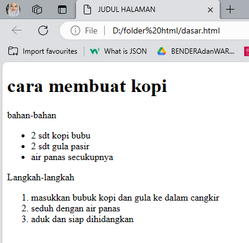

## Link 
Link dapat ditemukan di lampir semua halaman web. Link/tautan memungkinkan sebuah teks yang ketika di klik akan pindah ke halaman lainnya. HTML menggunakan tag `<a>` untuk keperluan ini. Link ditulis  dengan `<a>` yang merupakan singkatan dari anchor (jangkar).

>[! faq]- Setiap tag `<a>` setidaknya memiliki atribut `href` Dimana `href ` berisi alamat yang di tuju. `href` adalah singkatan dari hypertext refences.

Atribut penting lainnya dari tag `<a>` atribut target menentukan tempat untuk membuka dokumen yang di tautkan. Atribut ==`target`== memiliki beberapa nilai salah satunya  ==`_blank`== yang berfungsi untuk membuka tautan di tab baru.

```html
<!DOCTYPE html>
<html>
    <head>
     <title>JUDUL HALAMAN </title>
    </head>
    <body>
        <h3> Menggunakan tag anchor </h3>
        <a href="https://www.google.com" target="_blank"> klik disini untuk ke google</a><br>

        <a href="file:///D:/folder%20html/dasar.html"> klik disini untuk kehalaman lain yang saya buat </a>

    </body>

</html>
```


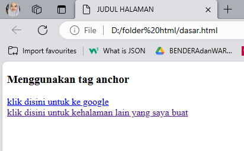

## Multimedia
### Gambar
Dalam HTML gambar didefinisikan dengan tag ``, tag `` adalah tag kosong hanya berisi atribut saja, dan tidak memiliki tag penutup.

>[! faq]- Atribut ==`<src>`== setidaknya mesti ada dalam tag ini untuk menentukan url (alamt web) dari gambar yang ingin ditampilkan.

Atribut `alt` menyediakan teks alternatif untuk gambar jika pengguna karena beberapa alasan tidak dapat melihatnya (karena koneksi lambat, kesalahan pada atribut `src`, jika web browser telah disetting untuk tidak ditampilkan gambar).

Dalam tag `` terdapat juga atribut `witdh` dan `height` untuk mengatur ukuran gambar pada versi HTML5 standar satuan ukuran gambar adalah `alt` 
- Misalnya dalam folder terdapat file gambar bernama logo.png untuk menampilkan gambar tersebut kita hanya perlu mengisi nama gambar beserta jenis ekstensi file gambar ke dalam atribut `src` contoh `src="logo.png"` 
- Untuk menampilkan gambar dari internet carilah link gambar yang akan di tampilkan lalu memasukkan dalam atribut `src`

```html
<!DOCTYPE html>
<html>
    <head>
     <title>JUDUL HALAMAN </title>
    </head>
    <body>
        
    </body>
</html>
```

Hasil:
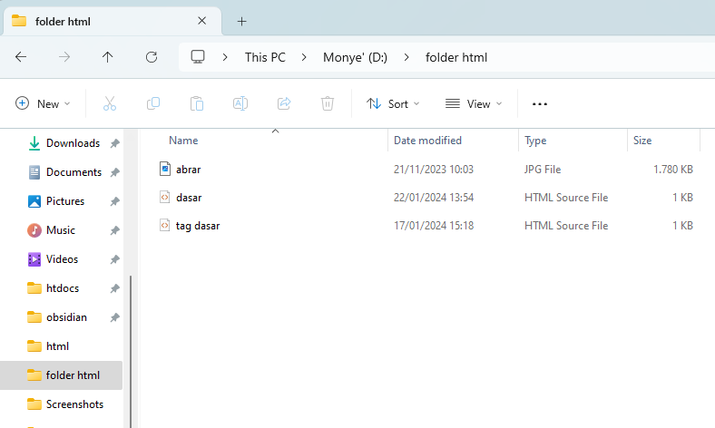


### Video
Fitur HTML5 mencakup dukungan audio dan video asli tanpa memerlukan Flash. Tag `<audio>` dan `<video>` pada HTML5 mempermudah penambahan media ke dalam halaman web. Yang penting untuk diatur pada tag ini adalah atribut src yang berfungsi untuk mengidentifikasi sumber media. Selain itu, terdapat pula atribut controls agar pengguna dapat memutar dan menjeda media.

```html
<!DOCTYPE html>
<html>
    <head>
     <title>JUDUL HALAMAN </title>
    </head>
    <body>
        <video src="foo.mp4"  width="300" height="200" controls>  
            Browser anda tidak mendukung elemen <video>.  
    </video>
    </body>
</html>
```

Konten berupa teks “Browser anda tidak mendukung elemen `<video>`.“ pada tag `<video>` akan ditampilkan jika browser tidak mendukung elemen tersebut. Sehingga sebenarnya bagian ini dapat dihilangkan.

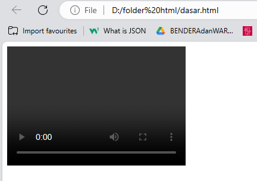


### Audio
Seperti yang telah dibahas sebelumnya bahwasanya tag `<audio>` merupakan bagian fitur HTML5 untuk menampilkan audio asli di halaman web tanpa memerlukan Flash sebagaimana pada HTML versi 4. Yang penting untuk diatur pada tag ini adalah atribut src yang berfungsi untuk mengidentifikasi sumber media. Selain itu, terdapat pula atribut controls agar pengguna dapat memutar dan menjeda media.

```html
<!DOCTYPE html>
<html>
    <head>
     <title>JUDUL HALAMAN </title>
    </head>
    <body>
        <audio src="audio.wav" controls>
            Browser anda tidak mendukung elemen <audio>
    </audio>
    </body>
</html>
```

Konten berupa teks “Browser anda tidak mendukung elemen `<video>`.“ pada tag `<video>`      akan ditampilkan jika browser tidak mendukung elemen tersebut. Sehingga sebenarnya bagian ini dapat dihilangkan.

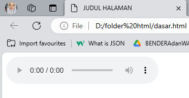

### Halaman Web lain
Elemen `<iframe>` dapat digunakan untuk menampilkan halaman website lain dalam suatu website. Atau menampilkan dokumen HTML lain dalam sebuah website. Mudahnya, bisa dibilang website dalam website.

>[! faq]- Contoh penggunaannya seperti ini. Jika kita mempunyai website sekolah, lalu di website tersebut ingin menampilkan alamat dalam google maps sekolah. Agar memudahkan pengunjung website, kita bisa langsung tampilkan saja halaman sekolah yang ada di google maps.

Dalam tag `iframe` ada beberapa atribut yang penting seperti :

- `src`, untuk mencari sumber halaman html atau web yang akan ditampilkan di dalam frame
- **`width`** dan **`height`**, untuk mengatur ukuran panjang dan lebar dari frame.

```html
<!DOCTYPE html>
<html>
    <head>
     <title>JUDUL HALAMAN </title>
    </head>
    <body>
        <iframe src="http://smkn7makassar.sch.id/" width="600" height="400"></iframe>
    </body>
</html>
```

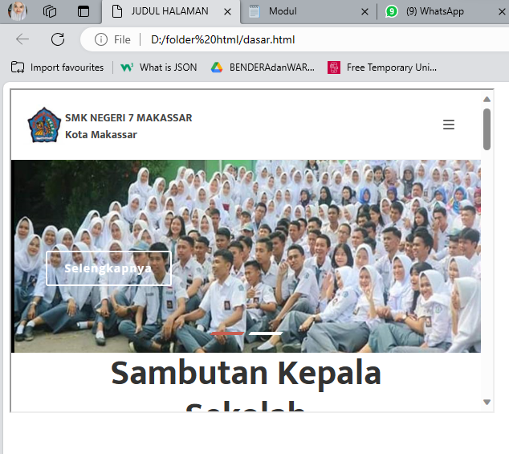

# Tabel
### Tabel 1
Tabel dalam HTML didefinisikan dengan tag `<table>.`
- Setiap baris tabel didefinisikan dengan tag **`<tr>`.**
- Header (judul) tabel didefinisikan dengan tag **`<th>`**. Secara default, header tabel memiliki teks tebal dan berada di tengah.
- Data tabel/sel didefinisikan dengan tag **`<td>`**. Karena sel merupakan bagian terkecil dari tabel maka dari itu tag ini selalu berada di dalam tag `<tr>`.

```html
<!DOCTYPE html>
<html>
    <head>
     <title>JUDUL HALAMAN </title>
    </head>
    <body>
        <table border="1">
            <tr>
                <th>Nama</th>
                <th>Asal Institusi</th>
            </tr>
            <tr>
                <td>Ibrahim Mallombasang</td>
                <td>Universitas Negeri Makassar</td>
            </tr>
            <tr>
                <td>Condrado Alain Sharon</td>
                <td>SMKN 7 Makassar</td>
            </tr>
            </table>
    </body>
</html>
```

Hasil:
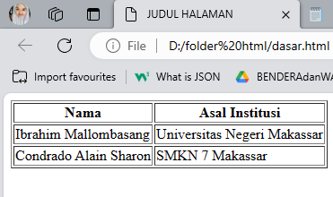

> [! faq]- Perhatikan bahwa pada tag `<table>` terdapat sebuah atribut border. Atribut border digunakan untuk memberikan nilai garis tepi dari tabel. Nilai ini dalam ukuran pixel. border=”1”, berarti kita mengistruksikan kepada web browser bahwa tabel tersebut akan memiliki garis tepi sebesar 1 pixel. Jika tidak ditambahkan, secara default tabel tidak memiliki garis tepi.

### Tabel 2
Penjelasan : 
Attribut "border" dalam elemen HTML `<table>` digunakan untuk menentukan ketebalan garis atau batas yang mengelilingi tabel. Nilai yang diberikan pada atribut "border" menentukan ketebalan garis dalam piksel.
Jika menggunakan atribut "border" dengan nilai "1" dalam elemen `<table>`, maka akan diterapkan garis tunggal dengan ketebalan 1 piksel di sekitar tabel. Garis ini akan mengelilingi setiap sel, baris, dan kolom dalam tabel, memberikan tampilan yang terdefinisi dengan jelas antara elemen-elemen tabel.

Contoh:
```html
<!DOCTYPE html>
<html>
    <head>
     <title>JUDUL HALAMAN </title>
    </head>
    <body>
        <table border="1"
            <tr>
                 <th rowspan="2">Nama</th>
               <th colspan="2">Asal Institusi</th>
            </tr>
            <tr>
               <th width="100">Sekolah</th>
               <th width="100">Kampus</th>
            </tr>
            <tr>
               <td> Muh Nur Irfan</td>
               <td>SMAN 14 Makassar</td>
               <td>Universitas Negeri Makassar</td>
            </tr>
            <tr>
                <td>Rezky Awalya </td>
                <td rowspan="3">MAN 1 Makassar</td>
                <td align="center" rowspan="3">-</td>
            </tr>
            <tr>
                 <td>Andi Ashadelah M.A</td>
            </tr>
            <tr>
                <td>Nur Inayah BENI</td>
           </tr>
            <tr>
                 <td>Muzhawir Amri</td>
                 <td>SMAN 1 Palu</td>
                 <td>STMIK Dipanegara</td>
            </tr>
        </table>
    </body>
</html>
```

Hasil:
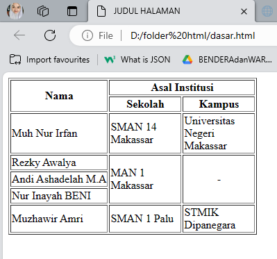

>[! faq]- 💡 Perhatikan pada konten elemen `<td>` yang berisi `Rezky Awalya` , hanya terdapat satu elemen `<td>` disana. Hal ini dikarenakan konten elemen `<td>` sebelumnya yaitu `SMKN 7 Makassar` dan `-` pada data `Condrado Alain Sharon` mengandung atribut `rowspan` dengan nilai `2` yang secara otomatis mengisi data di bawahnya yakni data `Rezky Awalya`. Nilai `2` menunjukkan bahwa ada dua baris yang digabungkan menjadi satu. Konsep ini juga sama dengan apa yang terjadi pada `<th rowspan="2">Nama</th>` dan `<th colspan="2">Asal Institusi</th>` .

### Tabel tugas 
Penjelasan : 
 1. `rowspan` merupakan atribut HTML yang berfungsi untuk menggabungkan beberapa baris (ke bawah)
2. `colspan` atau column span merupakan atribut HTML yang berfungsi untuk menggabungkan beberapa kolom (ke samping)
3. `width` berfungsi untuk mengatur lebar tabel yang nilainya didefinisikan dalam satuan pixel secara default
4. `height` berfungsi untuk mengatur tinggi tabel yang nilainya didefinisikan dalam satuan pixel secara default
5. `align` berfungsi untuk mengatur perataan teks pada tabel. Nilai atribut yang dapat diberikan yaitu left untuk perataan teks ke kiri, `right` untuk perataan teks ke kanan, dan `center` untuk perataan teks ke tengah.

Contoh : 
```html
<table border="1.5"h>
                <tr bgcolor="green">
                    <th colspan="2" width="100"> nama hari </th>
                    <th colspan="2" width="100"> nama bulan </th>
                </tr>
                <tr eight="50">
                    <td width="50"> Senin</td>
                    <td width="50"> selasa </td>
                    <td width="50"> april </td>
                    <td rowspan="2" width="50" align="center"> Juni </td>
                </tr>
                <tr height="50">
                    <td width="50"> rabu </td>
                    <td width="50"> kamis </td>
                    <td width="50"> mei </td>
                </tr>
        </table>
```
Hasil : 

## FORM
Elemen `<form>` HTML digunakan untuk mendefinisikan form yang digunakan untuk mengumpulkan inputan dari pengguna website. Tag ini digunakan untuk mengkoleksi inputan dari user, konsep ini sama seperti konsep formulir di dunia nyata.

>[! faq]- Dengan kata lain tag `<form>` merepresentasikan sebuah “formulir” di mana satu formulir bisa memiliki banyak kolom isian.

Form HTML berisikan elemen-elemen `form` lainnya. Elemen `<form>` digunakan untuk menampung macam-macam elemen yang berkaitan dengan sebuah `form`, seperti `text fields`, `checkbox`, `radio button`, tombol `submit`, dan banyak lagi yang dapat diedit kemudian ditulis untuk dikirim pada sebuah *server* untuk selanjutnya diproses guna mendapatkan informasi tertentu dari atau untuk *user*.

Umumnya, sebuah *website* selalu memiliki fitur *form*, contoh paling umum yang sering kita temui adalah seperti *form login*, *form sign up*, *form* komentar di suatu *blog*/media.

### Input
Elemen `<input>` adalah elemen `form` yang paling penting. Elemen `<input>` dapat
ditampilkan dalam beberapa cara, tergantung pada nilai atribut `type` yang digunakan. Berikut adalah beberapa contoh nilai dari atribut `type` :
- `text` digunakan untuk mengambil isian berupa **teks**. Contohnya seperti nama.
- `password` digunakan untuk mengambil isian berupa **kata sandi** atau sesuatu yang bersifat rahasia. Tipe ini akan mengubah semua karakter yang diketikkan ke dalam karakter bulat.
- `radio` digunakan sebagai kolom isian bertipe **pilihan** yang menawarkan beberapa opsi kepada *user* namun tetapi **hanya satu opsi saja** yang boleh dipilih. Contohnya seperti jenis kelamin atau agama.

>[! faq]- 💡 Perlu diperhatikan bahwa untuk penggunaan tipe `radio` yang berkategori set pilihan yang sama mengharuskan nilai `name` -nya juga sama.
Opsi *default* dapat dilakukan dengan menambahkan atribut `checked` pada elemen opsi yang dijadikan sebagai opsi *default*.

- `checkbox` digunakan untuk memberikan **daftar pilihan dalam satu set opsi**. *User* dapat memilih satu atau bahkan **lebih dari satu pilihan** pada tipe ini. Hal ini berbeda dengan tipe sebelumnya yaitu `radio` yang hanya memungkinkan *user* untuk memilih satu pilhan saja. Contoh penggunaan `checkbox` seperti daftar makanan kesukaan, daftar olahraga yang tidak disukai, dan yang semisalnya.

> [! faq]- Perlu diperhatikan bahwa untuk penggunaan tipe checkbox yang berkategori set pilihan yang sama mengharuskan nilai name -nya juga sama.

- `number` digunakan untuk membatasi isian *user* hanya pada karakter **numerik** saja. Browser akan menambahkan dua buah tombol atas dan bawah untuk mengubah angka isian.
    Beberapa atribut untuk tipe `number`:
    - `min` - menentukan angka minimal
    - `max` - menentukan angka maksimal
    - `step` - menentukan kelipatan (nilai yang tidak sesuai kelipatan tidak bisa di-*input*, dan *default* dari atribut ini adalah `1`
- `date` digunakan untuk memberikan isian berupa **tanggal**. Atribut `min` dan `max` dapat pula difungsikan pada tipe ini untuk mengatur tanggal minimal dan tanggal maksimal yang diinginkan. Nilai `min` dan `max` tersebut ditulis dengan format: `YYYY-MM-dd`.
- `file` digunakan untuk memungkinkan pengguna memuat _**file**._ Atribut `accept` juga dapat disisipkan pada tipe ini dengan maksud untuk mengatur _file_ apa saja yang boleh di-_upload_. Beberapa contoh _value_ dari atribut `accept` yaitu:
    - `accept**=**"image/png,image/jpg,image/jpeg"` - untuk file gambar seperti `png`, `jpg`, atau `jpeg`
    - `accept=".pdf"` - untuk file pdf
    - `accept=".doc, .docx"` - untuk file `doc` atau `docx`
    - `accept=".ppt, .pptx"` - untuk file `ppt` atau `pptx`
- `submit` ditampilkan dalam bentuk **tombol untuk mengirim data** pada `<form>` yang menjadi pembungkusnya. Atribut `value` digunakan untuk mengisi teks yang ingin ditampilkan pada tombol.
- `reset` berguna untuk **mengembalikan _state_ (keadaan) atau data dari suatu _form_ ke nilai awalnya**. Jika nilai awal sebuah input adalah kosong, maka ketika direset ia akan kembali kosong. Tapi jika nilai awalnya sudah terisi sesuatu, maka ketika direset datanya akan kembali seperti yang sudah diset sebelumnya.
- `button` berguna untuk membuat **inputan berupa sebuah tombol**. Tombol ini nantinya bisa difungsikan sesuai dengan keinginan dari pengembang web.
## Label
Elemen `<label>` memiliki fungsi khusus untuk **melabeli sebuah kolom inputan**. Ketika _screen reader_ membaca konten halaman HTML, lalu menemukan sebuah inputan, ia akan membaca label yang bersangkutan.

Fungsi lain dari tag `<label>` adalah ketika kita mengklik label, maka browser akan meletakkan fokus pada kolom isian yang terhubung dengannya. Syarat yang perlu diperhatikan yaitu dengan menghubungkan sebuah `<label>` dan `<input>` dengan atribut `for` untuk `label`, dan atribut `id` pada `<input>` dengan nilai untuk kedua atribut tersebut mesti sama persis.
### Select
Elemen `<select>` berguna dalam mendefinisikan sebuah tombol _**dropdown**_ yang dimana _user_ dapat memilih salah satu dari banyak pilihan.

>[! faq]- Elemen `<select>` nantinya berperan sebagai kontainer atau pembungkus dari elemen `<option>` yang berperan sebagai daftar pilihan atau opsi.

Elemen `<select>` hampir mirip fungsinya dengan `<input type=”radio">` akan tetapi baiknya elemen `<select>` digunakan untuk memilih satu pilihan yang terdapat banyak opsi di dalamnya, sedangkan `<input type=”radio">` lebih baiknya untuk digunakan jika _user_ diarahkan memilih hanya satu pilihan yang opsi pilihannya tidak terlalu banyak. Contoh penggunaan elemen ini seperti memasukkan pilihan berupa asal daerah atau yang semisalnya.

Penting untuk diketahui bahwasanya opsi yang aktif secara _default_ adalah adalah opsi yang pertama. Akan tetapi, kita bisa mengatur opsi mana yang aktif secara _default_ dengan menambahkan atribut `selected` pada suatu `<option>` yang ingin dijadikan sebagai opsi _default_.

### Text Area
Elemen `<textarea>` berguna untuk mengambil inputan _user_ berupa teks yang dapat memuat **lebih dari satu baris**. Jika dibandingkan dengan elemen `<input>` teks biasa, elemen `<textarea>` memiliki ukuran tinggi yang lebih besar. Element `textarea` bisa diisi lebih dari satu baris dengan menekan enter.

Atribut yang dapat digunakan untuk mengatur kuran dari `textarea` yaitu `rows` untuk jumlah baris, sedangkan atribut `cols` untuk lebarnya.

### Button
Elemen `<button>` yang berada di dalam sebuah form akan otomatis dianggap sama fungsinya seperti `<input type="submit">`. Jika ingin membuat tombol biasa yang tidak men-submit `<form>` dapat dilakukan dengan menambahkan atribut type="button".
Contoh;
```html
<h1>Formulir Pendaftaran</h1>
<form action="">
    <div>
      <label for="nama-lengkap"><b>Nama Lengkap:</b></label><br>
      <input type="text" id="nama-lengkap" name="nama_lengkap" placeholder="Masukkan nama lengkap" required>
     </div>

     <div>
       <label for="password"><b>Password:</b></label><br>
       <input type="password" id="password" name="password" placeholder="Masukkan password" required>
      </div>

      <div>
        <b>Jenis Kelamin:</b><br>
        <input id="lk" type="radio" name="jenis_kelamin" checked>
        <label for="lk">Laki-Laki</label>

        <input id="pr" type="radio" name="jenis_kelamin">
        <label for="pr">Perempuan</label>
      </div>

      <div>
        <label for="isian-usia"><b>Usia:</b></label><br>
        <input type="number" id="isian-usia" name="usia" min="17" max="25" value="19" required> Tahun
      </div>

      <div>
         <label for="tgl-ijazah"><b>Tanggal Ijazah:</b></label> <br>
         <input type="date" id="tgl-ijazah" name="tgl_ijazah" min="2021-01-01" value="2023-06-20" required>
      </div>

      <div>
         <label for="opsi-agama"><b>Agama:</b></label><br>
         <select id="opsi-agama" name="agama" required>
           <option disabled>---Pilih Agama----</option>
           <option value="islam">Islam</option>
           <option value="kristen">Kristen</option>
           <option value="katolik">Katolik</option>
           <option value="hindu">Hindu</option>
           <option value="buddha">Buddha</option>
           <option value="atheis" disabled>Atheis</option>
          </select>
       </div>

       <div>
          <label for="alamat"><b>Alamat:</b></label> <br>
          <textarea id="alamat" name="alamat" cols="25" rows="5" placeholder="Harap masukkan alamat secara lengkap" required></textarea>
       </div>

       <div>
          <b>Kemampuan Berbahasa Asing:*</b><br>
	        <input type="checkbox" id="inggris" name="bahasa_asing">
	        <label for="inggris">Inggris</label>

          <input type="checkbox" id="arab" name="bahasa_asing">
          <label for="arab">Arab</label>
                
          <input type="checkbox" id="jepang" name="bahasa_asing">
          <label for="jepang">Jepang</label>
       </div>

       <div>
          <label for="isian-foto"><b>Foto 4x6:*</b></label><br>
          <input type="file" id="isian-foto" name="foto" accept="image/png,image/jpg,image/jpeg">
       </div>

       <br>
       <input type="submit" value="Kirim">
       <input type="reset" value="Batal">
       <i>*opsional (tidak wajib diisi)</i>
</form>
```

Hasil : 
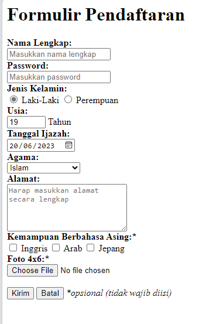

Beberapa atribut yang digunakan pada contoh di atas yang perlu untuk diperjelas yaitu sebagai berikut:
- `name` - digunakan sebagai nama variabel yang akan diproses oleh _web server_ (contoh menggunakan PHP)
- `required` - digunakan untuk memastikan bahwa pengguna harus memasukkan nilai pada input tersebut sebelum dapat melakukan proses submit formulir
- `placeholder` - menuliskan teks pada elemen input. Placeholder sangat bermanfaat untuk memberikan teks bantuan kepada _user_ untuk inputan _form_ yang kompleks
- `value` - menentukan nilai awal dari sebuah elemen input
- `disabled` - digunakan untuk menonaktifkan inputan pada elemen yang diberi atribut ini 

## Bagaimana cara memproses form
Ketika sebuah `<form>` disubmit, baik menggunakan elemen `<button>` mau pun `<input type="submit">`, browser akan mengirimkan data tersebut kepada URL yang didefinisikan pada atribut `action` di dalam tag `form`.

Ada pun jika atribut `action` tidak didefinisikan, maka _browser_ akan menggunakan URL sekarang sebagai tujuan pengiriman data.

Contoh :
```html
<form action="/proses-pendaftaran">
  ...
</form>
```

Pada contoh di atas, ketika form di-_submit_, _browser_ akan mengirimkan data yang ada menuju URL `/proses-pendaftaran`.

**Apa yang terjadi pada URL `/proses-pendaftaran`?** 
Pada URL tersebut terdapat sebuah aplikasi/program yang berjalan di _server_ (bukan di _browser_). Tugas dari program tersebut adalah mengelola data yang dikirim seperti misalnya menyimpan data tersebut ke dalam sebuah _database_.
Bahasa yang umum digunakan di dalam server adalah python, nodejs, PHP, dan lain sebagainya.
Untuk mendapatkan gambaran lebih jelas, sebenarnya akan dijelaskan pada modul selanjutnya yang berkaitan dengan materi PHP atau juga bisa dengan membaca tutorial berikut:
https://jagongoding.com/web/php/web-dinamis/membuat-dan-menangani-form/

## Tugas FORM 
Penjelasan : 
1. Elemen `<label>` digunakan untuk membuat label yang terkait dengan elemen HTML lainnya, seperti input field atau elemen form lainnya.
2. Elemen `<input>` adalah elemen yang digunakan untuk mengambil input dari pengguna. jenis input yang ditentukan adalah `type="text"`, yang berarti input yang diharapkan adalah teks.
3. `rowspan` merupakan atribut HTML yang berfungsi untuk menggabungkan beberapa baris (ke bawah)
Contoh : 
```html
<!DOCTYPE html>
<html>
    <head>
        <title>form tgs</title>
    </head>
    <body>
        <!-- for untuk mengarahkan dan harus sama dengan id -->
        <form action="">
            <div>
            <label for="nama">nama: </label>
            <input type="text" id="nama" required=""><br> <br>
            </div>
            <div>
            <label for="password">password: </label>
            <input type="password" id="password" required=""><br> <br>
            </div>
        <!-- name sebuah atribut yang berfungsi untuk bsa memilih 1-->
            <label for="jenis kelamin">jenis kelamin: </label>
            <input type="radio" name="jk" id="jenis kelamin" >
            <label>laki-laki</label>
            <input type="radio" name="jk" id="jenis kelamin" checked>
            <label>perempuan</label><br> <br>
            <label for="coding"> coding: </label>
            <input type="checkbox" name="web" id="coding"> web
            <input type="checkbox" name="mobile" id="coding"> mobile
            <input type="checkbox" name="desktop" id="coding"> desktop
            <br> <br>
            <!--value gunanya untuk tulisan ditombol, -->
            <input type="submit" value="kirim">
            <input type="reset" value="ulang"><br> <br>
            pesan anda:
            <textarea></textarea>
        </form>
    </body>
</html>
```

Hasil : 
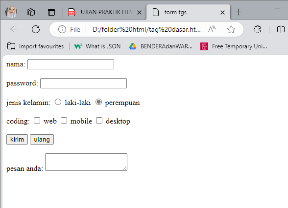

# DIV & SPAN
## `<div>`
`<div>` adalah tag HTML yang digunakan untuk membuat blok konten. Tag ini digunakan untuk mengelompokkan konten dan memberikan atribut tertentu pada blok tersebut.
Contoh: 
```html
<!DOCTYPE html>
<html>
<head>
    <title>DIV SPAN</title>
</head>
<body>
    <!-- div digunakan untuk memblok satu area dengan tanda baris
    baru setelahnya-->
    <div> ini dibuat menggunakan div </div>
    <div> ini juga menggunakan div</div>
</body>
</html>
```

Hasil: 
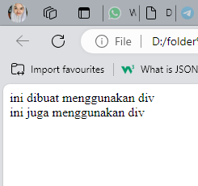

## `<span>`
`<span>` adalah tag HTML yang digunakan untuk membuat blok konten yang tidak memiliki atribut tertentu.
Contoh: 
```html
<!DOCTYPE html>
<html>
<head>
    <title>DIV SPAN</title>
</head>
<body>
    <!-- kebalikan <div>-->
    <span> ini digunakan untuk span</span>
    <span> ini juga menggunakan span </span>
</body>
</html>
```
Hasil:
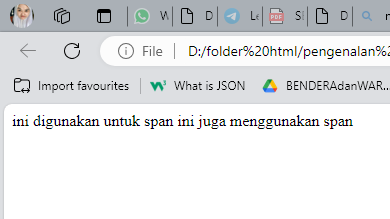


